# Project Architecture: Autonomous Options Trading Agent

## Executive Summary

The **Alpaca Autonomous Options Trading Agent** is an end-to-end, multi-stage trading system engineered for short-horizon directional options trading on US equities and liquid ETFs. The system blends **deterministic quantitative finance** (Black-Scholes-Merton analytic pricing, numerical volatility solving, regime detection, portfolio optimization, hard risk limits) with **probabilistic generative AI** (real-time news compression, qualitative thesis evaluation, cross-asset ordinal ranking).

A central design principle governs the system: **"Deterministic Code Guards; LLMs Discover and Discriminate."**
No LLM is ever permitted to calculate prices, size positions, decide risk allocations, or trigger stop-losses. Instead, deterministic quantitative models filter and score the search space, LLMs provide contextual intelligence and ranking over sanitized candidates, and deterministic execution/risk managers govern capital deployment and order lifecycles.

---

## Complete Pipeline Architecture

The pipeline operates as an autonomous, dual-cadence state machine:

```mermaid
flowchart TD
    subgraph S1["1. Universe & Market Data"]
        U[200+ Liquid US Equities & ETFs\nstrategy/universe.py] --> SB[Historical Daily Bars 90d\nalpaca_client/stocks.py]
    end

    subgraph S2["2. Quantitative Scanner"]
        SB --> SC[Cross-Sectional Factor Engine\nstrategy/scanner.py]
        SC --> |Mom 30%, Vol 25%, RegVol 20%, RS 15%, Tr 10%| TOP25[Top N Scanned Underlyings\ndefault: 25]
    end

    subgraph S3["3. Research & Earnings Filter"]
        TOP25 --> NA[Alpaca News Fetcher\nstrategy/news.py]
        NA --> RA[Featherless News Compression Agent\nstrategy/research_agent.py]
        RA --> EV{Deterministic Earnings Veto\nstrategy/earnings.py}
        EV -->|Earnings within 14 DTE| VETO[Vetoed & Discarded]
        EV -->|Safe Candidates| SAFE[Earnings-Safe Underlyings]
    end

    subgraph S4["4. LLM Stock Ranker"]
        SAFE --> LR[Featherless LLM Stock Ranker\nstrategy/llm_ranker.py]
        LR --> |Top K Ordinal Permutation| SEL_STOCKS[Top Selected Stocks\ndefault: 10]
        SEL_STOCKS --> DIR[Direction Classifier\nstrategy/direction.py\n2-of-3 Signal Majority]
    end

    subgraph S5["5. Option Selector (Quant)"]
        DIR --> OC[Alpaca Option Chains\nalpaca_client/options.py]
        OC --> OS[BSM Pricing & Gate Engine\nstrategy/option_selector.py]
        OS --> |10 Strict Gates: Spread, IV/RV, Theta, BE, Exp| POOL[Curated Option Pool\nUp to 4 per Stock]
    end

    subgraph S6["6. Option LLM Ranker"]
        POOL --> OR[Cross-Asset Global LLM Ranker\nstrategy/option_ranker.py\nMasked OPTxxx IDs]
        OR --> TOP_OPT[Globally Ranked Options\ndefault: Top 12]
    end

    subgraph S7["7. Portfolio Construction"]
        TOP_OPT --> TF[TradeCandidate Factory\nexecution/trade_factory.py]
        TF --> DEDUP[Deduplicate to 1 Best Trade / Stock]
        DEDUP --> PC[Defined-Loss Sizing Engine\nstrategy/portfolio.py\nRank-decay weighting]
    end

    subgraph S8["8. Risk Management Layer"]
        PC --> RM[Deterministic Risk Engine\nrisk/risk.py]
        RM -->|Drawdown >= 15%| EM_STOP[Emergency Stop]
        RM -->|Caps: 20% Total, 2.5% Trade, 3% Stock, 15% Dir| APP_POS[Risk-Approved Positions]
    end

    subgraph S9["9. Execution Engine (Alpaca)"]
        APP_POS --> PL[Execution Planner & Idempotency\nexecution/planner.py]
        PL --> VAL[Pre-Trade Live Quote Validator\nexecution/validator.py]
        VAL --> EX[Alpaca Paper Broker Order Submission\nexecution/executor.py]
        EX --> JRNL[Execution Journal\nlogs/execution.jsonl]
        EX --> FV[Fill Verification & Stale Order Cancellation\nexecution/position_manager.py]
    end

    subgraph S10["10. Autonomous Loop & Exit Management"]
        FV --> STATE[(Local State Store\nstate/positions.json)]
        STATE --> EM[Exit Manager: 6-Tier Rules\nstrategy/exits.py\nBid-based Realisable P&L]
        EM --> |Every 5 min| EXITS[Close Triggered Positions]
        EXITS --> CADENCE{Slots Available?}
        CADENCE -->|Yes & Window Open| S2
        CADENCE -->|No or Waiting 15m| S10
    end
```

---

## Detailed Pipeline Component Breakdown

### Stage 1: Universe Selection (`strategy/universe.py`)
- **Asset Universe**: 200+ liquid U.S. equities and ETFs across:
  - Mega-cap Technology, Semiconductors & Software (`AAPL`, `MSFT`, `NVDA`, `AVGO`, `ORCL`, `PLTR`, `ARM`, `SMCI`).
  - High-beta Fintech, Crypto-proxies & Volatility (`COIN`, `MSTR`, `HOOD`, `MARA`, `RIOT`).
  - Consumer Discretionary & High-Growth (`TSLA`, `AMZN`, `UBER`, `RDDT`).
  - Leveraged & Index ETFs (`SPY`, `QQQ`, `IWM`, `TQQQ`, `SQQQ`, `SOXL`, `SMH`, `SPCX`).
- **Benchmark**: `SPY` (Standard S&P 500 ETF) for relative strength calculation.
- **Data Feed**: Daily historical OHLCV bars fetched via Alpaca Market Data API (`IEX` feed) using a 90-calendar-day historical window.

---

### Stage 2: Quantitative Scanner (`strategy/scanner.py`, `alpaca_client/stocks.py`)
Processes completed daily bars into cross-sectional technical scores.
- **Lookahead Prevention**: Enforces `_completed_daily_bars` strictly prior to the current exchange date on the `America/New_York` clock.
- **Raw Factor Indicators**:
  1. **Momentum**: `raw_momentum = 0.20 * ret_1d + 0.30 * ret_5d + 0.50 * ret_20d`
  2. **Volume Expansion**: `volume_ratio = current_volume / avg_volume_20d`
  3. **Realized Volatility**: 20-day annualized log-return standard deviation:
     $$\sigma_{\text{realized}} = \text{std}(\ln(P_t / P_{t-1})) \times \sqrt{252}$$
  4. **Relative Strength vs SPY**: 20-day excess return over benchmark:
     $$\text{RS} = \text{ret\_20d}_{\text{stock}} - \text{ret\_20d}_{\text{SPY}}$$
  5. **Trend Alignment**: Distance from 20-day and 50-day Simple Moving Averages:
     $$\text{raw\_trend} = 0.50 \times \frac{P - \text{SMA}_{20}}{\text{SMA}_{20}} + 0.50 \times \frac{P - \text{SMA}_{50}}{\text{SMA}_{50}}$$
- **Normalization**:
  - Momentum, Volume, RS, and Trend are converted to 0–100 cross-sectional percentiles using average-rank calculation.
  - **Volatility Regime Scoring**: Realized volatility is scored **piecewise linearly** against an optimal tradeability band:
    - `VOL_FLOOR = 0.10` (score 0)
    - `VOL_BAND_LOW = 0.30` to `VOL_BAND_HIGH = 0.45` (score 100)
    - `VOL_CEILING = 0.90` (score 0)
    *Rationale: Names below 30% vol cannot travel enough to overcome option premium decay; names above 90% vol suffer from unaffordable implied volatility and severe jump risk.*
- **Composite Score**:
  $$\text{Scanner Score} = 0.30 \times \text{Mom} + 0.25 \times \text{Vol} + 0.20 \times \text{Vola} + 0.15 \times \text{RS} + 0.10 \times \text{Trend}$$
- **Output**: Top `STOCK_SCANNER_TOP_N` candidates (default: 25).

---

### Stage 3: Research Agent & Deterministic Earnings Veto (`strategy/research_agent.py`, `strategy/earnings.py`)
- **News Extraction**:
  - Concurrently queries Alpaca News REST API (`/v1beta1/news`) across candidates with multi-worker threads (`ThreadPoolExecutor`).
  - Lookback: 5 days, dynamically expanding to 14 days if articles are sparse.
  - Deterministic relevance scoring: Symbol tag density (+50 for solo symbol, -40 for broad baskets), company aliases (`CRM` $\rightarrow$ Salesforce, `GOOGL` $\rightarrow$ Alphabet), and noise pattern suppression (e.g., "whale alerts", "halftime report").
- **LLM News Compression (`Featherless`)**:
  - Summarizes news without hallucinating or predicting prices.
  - Compact JSON Output:
    ```json
    {
      "news": "Concise summary sentence (max 40 words)",
      "catalyst": "Near-term catalyst or null",
      "risk": "Key contradiction/risk or null",
      "timing": "IMMEDIATE | NEAR_TERM | UNKNOWN | NONE"
    }
    ```
- **Deterministic Earnings Veto (`strategy/earnings.py`)**:
  - **Why deterministic**: LLMs frequently classify upcoming quarterly earnings calls as positive catalysts, ignoring the post-announcement volatility crush (*IV crush*) that destroys short-dated long option premium.
  - Scans research dossiers with regex date extractors and forward-looking phrase detectors (e.g., `"scheduled to report"`, `"q3 earnings"`).
  - Vetoes any underlying reporting within `MAX_DTE` (14 days). Prevents non-tradeable binary bets before tokens are spent on ranking.

---

### Stage 4: LLM Stock Ranker (`strategy/llm_ranker.py`)
- **Model**: Featherless OpenAI-compatible chat completion API (`FEATHERLESS_MODEL`).
- **De-biasing**: Candidates are presented in a **cryptographically randomized order** (`SystemRandom().shuffle`) with scanner metrics and qualitative research text to prevent presentation-order bias.
- **Task**: Ordinal comparative ranking across candidates for short-horizon options opportunity.
- **Output Validation**: Strict JSON array permutation parser (`["NVDA", "CRM", "AMD", ...]`). Validates that every candidate is included exactly once with no extraneous or missing symbols.
- **Filter**: Excludes any stocks already held in the portfolio. Selects top `LLM_STOCK_TOP_K` (default: 10).
- **Direction Determination (`strategy/direction.py`)**:
  - Direction is assigned deterministically using a 2-of-3 majority rule across:
    1. 5-day return (`ret_5d > 0`)
    2. 20-day return (`ret_20d > 0`)
    3. Relative strength vs SPY (`rs_spy > 0`)
  - If 2+ are positive $\rightarrow$ **BULLISH** (calls only).
  - If 2+ are negative $\rightarrow$ **BEARISH** (puts only).
  - Mixed/neutral signals $\rightarrow$ **NEUTRAL** (discarded).

---

### Stage 5: Option Selector (`strategy/option_selector.py`, `alpaca_client/options.py`)
- **Full Chain Ingestion**: Fetches option snapshots for target underlyings from Alpaca Options Market Data API.
- **Analytical Pricing & Greek Engine**:
  - BSM pricing (`bsm_price`) and exact analytic Greeks (`bsm_greeks`: Delta, Gamma, Theta, Vega).
  - Numerical implied volatility solver via bisection (`implied_volatility`).
  - Fractional time-to-expiry (`time_to_expiry_years`) calculated down to the 16:00 ET close.
- **Deterministic Hard Gates** (evaluated in cause-before-symptom order):
  1. *Type Alignment*: Bullish $\rightarrow$ Calls; Bearish $\rightarrow$ Puts.
  2. *DTE Range*: $1 \le \text{DTE} \le 14$ days.
  3. *Expiration Guard*: Expiration strictly after `LATEST_FORBIDDEN_EXPIRATION`.
  4. *Premium Floor*: $\text{Mid} \ge \$0.25$.
  5. *Delta Window*: $0.15 \le |\Delta| \le 0.90$.
  6. *Spread Friction Gate*: $\text{Spread Pct} \le 8\%$ (with $\$0.02$ absolute tick escape hatch for low-dollar contracts).
  7. *Variance Risk Premium Gate*: $\text{IV} / \text{RV} \le 1.60$ (rejects contracts overcharging for implied vol).
  8. *Theta Burn Gate*: $|\Theta| / \text{Ask} \le 12\%/\text{day}$.
  9. *Breakeven Ratio Gate*: $\text{Breakeven Move} / \text{Expected Move} \le 1.15$.
  10. *Net Expected Return Gate*: $\text{Expected Return} \ge -10\%$.
- **Scenario Expected-Return Engine**:
  - Evaluates underlying price drift over `PLANNED_HOLD_DAYS = 2.0` across 7 standard normal nodes $(\pm 3\sigma, \pm 2\sigma, \pm 1\sigma, 0\sigma)$.
  - Reprices contract at implied volatility and subtracts half-spread exit friction on exit.
- **Option Scoring Model (0–100)**:
  $$\text{Option Score} = 0.45 \times S_{E[R]} + 0.25 \times S_{\text{PoP}} + 0.20 \times S_{\text{VRP}} + 0.10 \times S_{\text{Shape}}$$
- **Output**: Up to `MAX_OPTIONS_PER_STOCK` (default: 4) best contracts per underlying.

---

### Stage 6: Option LLM Ranker (`strategy/option_ranker.py`)
- **Global Cross-Underlying Comparison**: Takes the pool of surviving options across all candidate underlyings.
- **Anonymized Identification**: Contracts are assigned temporary masked IDs (`OPT001`, `OPT002`, ...) over a shuffled pool. The model cannot infer rank from ticker prominence or list position.
- **Prompt Criteria**: Evaluates underlying thesis fit, strike responsiveness vs. premium, catalyst timing, liquidity, Greeks efficiency, and cross-asset diversity.
- **Diversity Constraint**: Enforces a strict ceiling of at most 2 contracts selected from any single underlying stock.
- **Validation**: Ensures exact Top-K IDs are returned and decodes them back to canonical OCC symbols.
- **Output**: Top `OPTION_LLM_TOP_K` (default: 12) option contracts globally.

---

### Stage 7: Portfolio Construction (`strategy/portfolio.py`, `execution/trade_factory.py`)
- **Trade Factory**: Maps ranked options and stock metadata into `TradeCandidate` objects.
- **Underlying Deduplication**: Filters candidate pool to ensure **strictly one trade per underlying stock**, retaining the option with the highest global LLM rank.
- **Defined-Loss Sizing**:
  - For long single-leg options:
    $$\text{Max Loss Per Contract} = \text{Ask Price} \times 100$$
  - Sizing uses the live ask, never the midpoint.
- **Rank-Decay Risk Allocation**:
  $$\text{Weight}_i = (\text{Total Candidates} - \text{Rank}_i)^{1.5}$$
- **Capital & Budget Constraints**:
  - Total portfolio risk budget: `MAX_TOTAL_RISK_PCT = 20%` of account equity.
  - Maximum risk per trade: `MAX_SINGLE_TRADE_RISK_PCT = 2.5%` of account equity.
  - Sized strictly against currently available free slots (`open_slots = MAX_POSITIONS - current_held`).
  - Integer contract rounding: $\text{Contracts} = \lfloor \text{Allocated Risk} / \text{Per Contract Risk} \rfloor$.

---

### Stage 8: Risk Management Layer (`risk/risk.py`)
Final deterministic safety barrier before execution.
1. **Emergency Drawdown Veto**:
   $$\text{Drawdown} = \frac{\text{Peak Equity} - \text{Current Equity}}{\text{Peak Equity}} \ge 15\% \implies \text{EMERGENCY STOP (All new trading halted)}$$
2. **Position-Level Loss Cap**: Clamps single trade exposure to $\le 2.5\%$ equity.
3. **Underlying Concentration Cap**: Restricts aggregate exposure to any single underlying to $\le 3.0\%$ equity.
4. **Total Portfolio Risk Cap**: Ensures sum of approved max losses $\le 20.0\%$ equity.
5. **Directional Concentration Limits**:
   - Bullish Exposure $\le 15.0\%$ of account equity.
   - Bearish Exposure $\le 15.0\%$ of account equity.
   - Truncates lower-priority positions in the over-concentrated direction.
6. **Portfolio Greek Advisory Thresholds**: Monitors Net Delta ($\le 1,500$), Net Gamma ($\le 100$), and Net Vega ($\le 3,000$).

---

### Stage 9: Execution Engine & Alpaca Integration (`execution/`)
- **Alpaca Broker Adapter (`alpaca_broker.py`)**:
  - Direct connection to Alpaca Trading API & Options Data API.
  - Hard safety check: Verifies `_paper=True` and rejects any non-paper URL.
- **Pre-Trade Live Validation (`validator.py`)**:
  - Re-checks live quotes milliseconds before order submission.
  - Rejects if spread widened past 8%, if ask moved $> 5\%$ above reference, if contract is not tradable, or if an order/position already exists.
- **Idempotency & Order Generation (`planner.py`, `executor.py`)**:
  - Deterministic client order ID: `oa-{strategy_run_id}-{intent_id}`.
  - Queries Alpaca by `client_order_id` prior to submission to prevent duplicate orders across crashes or retries.
  - Submits **Marketable Limit Orders**:
    $$\text{Limit Price} = \text{round}(\text{Live Ask} \times (1.0 + \text{buffer}), 2)$$
- **Audit Journal (`execution/journal.py`)**: Appends structured JSON records to `logs/execution.jsonl`.
- **Fill Verification (`position_manager.py`)**:
  - Waits 20 seconds after submission. Queries Alpaca for fill confirmation.
  - If unfilled, **cancels the resting order immediately** and clears optimistic local state. Resting entry limit orders are never left open to fill against stale quotes.

---

### Stage 10: Autonomous Loop & Exit Management (`main.py`, `strategy/exits.py`, `strategy/state.py`)
- **Asymmetric Cadence**:
  - **Exits Cycle**: Runs every **5 minutes** (`EXIT_INTERVAL_SECONDS = 300`). Deterministic, zero LLM calls, marks and closes open positions.
  - **Entries Cycle**: Runs at most every **15 minutes** (`ENTRY_INTERVAL_MINUTES = 15`), and immediately whenever an exit frees a slot.
- **Trading Windows**:
  - No new entries during first 10 minutes after market open (wide open spreads).
  - No new entries during final 10 minutes before market close.
- **Realisable P&L**: Marked strictly against the **live BID**, not the midpoint mark:
  $$\text{Realisable P&L} = \frac{\text{Live Bid} - \text{Entry Price}}{\text{Entry Price}}$$
- **Deterministic 6-Tier Exit Hierarchy** (evaluated in strict order of urgency):
  1. `FLATTEN_WINDOW` (*Immediate*): Competition valuation snapshot deadline reached $\rightarrow$ Close all.
  2. `EXPIRY` (*Immediate*): $\text{DTE} \le 1$ day $\rightarrow$ Close immediately.
  3. `STOP_LOSS` (*Immediate*): $\text{P&L} \le -55\% \rightarrow$ Hard stop exit.
  4. `TRAILING_STOP` (*Normal*): Arms when $\text{Peak P&L} \ge +30\%$. Exits if position surrenders $> 35\%$ of peak:
     $$\text{Trailing Floor} = \text{Peak P&L} \times (1.0 - 0.35)$$
  5. `TAKE_PROFIT` (*Normal*): $\text{P&L} \ge +120\% \rightarrow$ High-water fixed target.
  6. `TIME_STOP` (*Normal*): $\text{Days Held} \ge 2.5 \text{ days} \rightarrow$ Exit due to theta exhaustion.
- **Local State Synchronization (`state/positions.json`)**:
  - Atomically writes state via temporary file replace and `os.fsync`.
  - Reconciles with Alpaca broker positions every cycle: prunes positions closed externally and adopts untracked fills.

---

## Data Models & Type Contracts

```mermaid
classDiagram
    class ScannedStock {
        +str symbol
        +float price
        +float return_1d
        +float return_5d
        +float return_20d
        +float volume_ratio
        +float realized_volatility
        +float relative_strength_spy
        +float score
        +int rank
    }

    class ResearchReport {
        +str symbol
        +str quantitative_summary
        +str news
        +str catalyst
        +str risk
        +str timing
        +int article_count
        +to_text() str
    }

    class OptionCandidate {
        +str symbol
        +date expiration
        +str option_type
        +float strike
        +float bid
        +float ask
        +float mid
        +float spread_pct
        +float iv
        +float delta
        +float gamma
        +float theta
        +float vega
        +int dte
        +float fair_value
        +float expected_return
        +float probability_of_profit
        +float score
    }

    class TradeCandidate {
        +str stock_symbol
        +str option_symbol
        +str direction
        +int dte
        +float strike
        +float option_ask
        +float trade_score
        +int stock_llm_rank
        +int option_llm_rank
    }

    class PortfolioPosition {
        +TradeCandidate trade
        +int contracts
        +float max_loss
        +float premium_deployed
        +float risk_weight
    }

    class PositionState {
        +str option_symbol
        +str stock_symbol
        +str direction
        +str opened_at
        +float entry_price
        +int contracts
        +float peak_pnl_pct
        +float trade_score
    }

    ScannedStock --> ResearchReport : feeds context to
    ResearchReport --> OptionCandidate : informs selection
    OptionCandidate --> TradeCandidate : packaged into
    TradeCandidate --> PortfolioPosition : sized into
    PortfolioPosition --> PositionState : tracked as
```



---

## Configuration & Hyperparameters (`config.py`)

| Parameter | Default Value | Purpose / Constraint |
|---|---|---|
| `STOCK_SCANNER_TOP_N` | `25` | Number of stocks passed from Scanner to Research Agent |
| `LLM_STOCK_TOP_K` | `10` | Top underlyings selected by LLM Stock Ranker |
| `MAX_OPTIONS_PER_STOCK` | `4` | Maximum option contracts passed from Option Selector per stock |
| `OPTION_LLM_TOP_K` | `12` | Contracts retained by Global Option LLM Ranker |
| `MAX_TOTAL_RISK_PCT` | `0.20` (20%) | Hard portfolio-wide defined loss limit |
| `MAX_SINGLE_TRADE_RISK_PCT` | `0.025` (2.5%) | Single trade loss limit |
| `MAX_UNDERLYING_RISK_PCT` | `0.03` (3.0%) | Maximum loss concentration per underlying stock |
| `MAX_DIRECTION_RISK_PCT` | `0.15` (15%) | Directional concentration cap (Bullish or Bearish) |
| `MAX_POSITIONS` | `8` | Maximum simultaneous open positions |
| `EMERGENCY_DRAWDOWN_PCT` | `0.15` (15%) | Account drawdown threshold triggering Emergency Stop |
| `MIN_DTE` / `MAX_DTE` | `1` / `14` | Option expiration tenor bounds |
| `MAX_OPTION_SPREAD_PCT` | `0.08` (8%) | Maximum acceptable bid-ask spread |
| `MIN_OPTION_ABS_DELTA` / `MAX` | `0.15` / `0.90` | Option delta acceptance range |
| `MIN_OPTION_PREMIUM` | `$0.25` | Premium floor to avoid low-liquidity penny options |
| `STOP_LOSS_PCT` | `-0.55` (-55%) | Hard stop-loss threshold |
| `TRAIL_ARM_PCT` | `+0.30` (+30%) | Profit hurdle required to activate trailing stop |
| `TRAIL_GIVEBACK_PCT` | `0.35` (35%) | Maximum profit giveback from peak before trailing exit |
| `TAKE_PROFIT_PCT` | `+1.20` (+120%)| Extended high-water fixed target |
| `MAX_HOLD_DAYS` | `2.5` days | Maximum holding period (time-stop) |
| `MIN_EXIT_DTE` | `1` day | Force close at 1 DTE to avoid expiry volatility |
| `EXIT_INTERVAL_SECONDS` | `300` (5 min) | Position management and exit evaluation frequency |
| `ENTRY_INTERVAL_MINUTES` | `15` min | New candidate screening and entry evaluation cadence |

---

## Safety, Resilience & Error Handling

1. **Strict Paper Trading Isolation**:
   - `ALPACA_PAPER_TRADE=true` environment requirement.
   - `AlpacaBroker._verify_paper_environment()` explicitly confirms broker endpoint contains `paper-api.alpaca.markets`. Any live credentials immediately trigger a `SafetyViolation` exception.
2. **Idempotency & Duplicate Prevention**:
   - All orders generated with deterministic `client_order_id`.
   - Broker state queried by `client_order_id` prior to submission to prevent duplicate fills.
3. **No Hanging Limit Orders**:
   - Entry orders that fail to fill within 20 seconds are automatically cancelled.
   - Working exit orders are **never cancelled**, ensuring safety on profit takes and stop-losses.
4. **Resilient Local State**:
   - `state/positions.json` uses atomic writes via temporary files and `os.fsync`.
   - Reconciles with Alpaca broker positions every cycle to account for external assignment, exercises, or manual closures.
5. **Consecutive Error Breakers**:
   - Main loop tolerates transient network/API drops up to `MAX_CONSECUTIVE_ERRORS = 5` before triggering a controlled shutdown, ensuring open positions are clearly reported.
