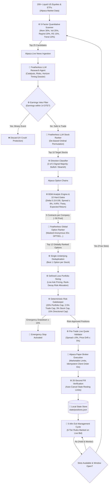

# 🦅 Alpaca Autonomous Options Trading Agent

> **"Determinism controls the money; Agents provide the intelligence."**

An end-to-end, fully autonomous options trading CLI agent designed to run continuously throughout the trading day until market close (4:00 PM ET). **You press one button, and the system handles everything:** market scanning, real-time news intelligence, stock ranking, quantitative option contract selection, cross-asset option ranking, defined-risk portfolio sizing, order execution on Alpaca Paper Trading, and active position lifecycle management with multi-tier exit guards.

---

## ⚡ Core Philosophy: Why Determinism + AI?

Most LLM trading experiments fail because they ask generative models to do things they are fundamentally ill-suited for: calculating prices, sizing positions, computing Greeks, or deciding stop-losses. 

Our architecture splits the workload into two strictly decoupled layers:
1. **Agents Provide the Intelligence**: Featherless-powered LLMs ingest unstructured live news, extract qualitative catalysts and risks, and perform comparative **ordinal ranking**.
2. **Determinism Controls the Money**: Rigorous mathematical algorithms (Black-Scholes-Merton pricing, numerical implied volatility solving, quantitative factor scoring, defined-loss risk allocation, and hard stop-loss/trailing-exit rules) handle every financial calculation and execute orders via the Alpaca API.

```
       PROBABILISTIC INTELLIGENCE (LLMs)          DETERMINISTIC CONTROLS (Quant Code)
     ┌────────────────────────────────────┐      ┌───────────────────────────────────┐
     │ • Real-time News Compression       │      │ • 5-Factor Technical Scanner      │
     │ • Cross-Sectional Stock Ranking    │      │ • Earnings Binary Risk Veto       │
     │ • Global Option Pool Ranking       │      │ • Black-Scholes-Merton Pricing    │
     │ • Catalyst & Narrative Evaluation  │      │ • 10 Quantitative Option Gates    │
     └────────────────────────────────────┘      │ • Defined-Loss Portfolio Sizing   │
                                                 │ • Hard Risk, VaR & Greek Limits   │
                                                 │ • Bid-Marked Exit Management      │
                                                 │ • Alpaca Broker Order Execution   │
                                                 └───────────────────────────────────┘
```

### 🎯 Our Secret Advantage: Ranking Over Scoring

A foundational breakthrough of this system is its insistence on **ordinal ranking rather than absolute scoring**:

| Traditional LLM Scoring (Flawed) | Our Ordinal Ranking Advantage |
|---|---|
| **Prompt & Temperature Drift**: Prompts like *"Score this stock from 1 to 100"* fluctuate wildly across API calls. | **Comparative Evaluation**: The LLM compares all candidates simultaneously: *"Given these 10 stocks and their research, which opportunity is superior to the others?"* |
| **Score Inflation**: LLMs often rate every exciting headline an 85+ or 90+, rendering scores useless for prioritization. | **Strict Permutation**: Forces a strict 1-to-$N$ ordering. No ties, no inflation, no arbitrary cutoff dilemmas. |
| **Hallucinated Thresholds**: Models struggle to map qualitative feelings to continuous mathematical values. | **Tournament Selection**: LLMs excel at cross-sectional discrimination and contextual trade-offs. |

---

## 🏛️ System Architecture & Workflow

The pipeline operates as an autonomous, multi-stage state machine that loops continuously during market hours:



---

## 🔍 Stage-by-Stage Breakdown

### 1. Deterministic Market Scanner
- Filters **200+ liquid US equities and ETFs** using completed daily bars fetched from Alpaca.
- Evaluates 5 cross-sectional factors:
  - **Momentum**: Weighted 1-day, 5-day, and 20-day returns.
  - **Volume Expansion**: Ratio of latest volume against 20-day average.
  - **Piecewise Realized Volatility**: Penalizes dead stocks ($< 30\%$) and chaotic lottery tickets ($> 90\%$), seeking an optimal volatility sweet-spot ($30\% - 45\%$).
  - **Relative Strength**: Excess return over the benchmark (`SPY`).
  - **Trend Alignment**: Distance from 20-day and 50-day Simple Moving Averages.
- Outputs the **Top 25 candidates**.

### 2. Featherless Research Agent & Earnings Veto
- Fetches recent news directly from the Alpaca News API (`/v1beta1/news`) using multi-threaded workers.
- The **Featherless LLM Research Agent** compresses articles into a dense, non-hallucinated qualitative dossier:
  ```json
  {
    "news": "Single-sentence concise summary (max 40 words)",
    "catalyst": "Near-term identifiable catalyst or null",
    "risk": "Contradiction or key vulnerability or null",
    "timing": "IMMEDIATE | NEAR_TERM | UNKNOWN | NONE"
  }
  ```
- **Deterministic Earnings Veto**: Deterministic regex scans detect scheduled earnings within 14 days. If an earnings release is near, the stock is immediately rejected to prevent post-announcement volatility collapse (*IV crush*).

### 3. LLM Stock Ranker & Direction Classifier
- Shuffles candidates cryptographically to eliminate presentation-order bias.
- The **Featherless Stock Ranker** evaluates technical scores alongside the news dossier and outputs an ordinal JSON permutation ranking the most compelling opportunities.
- Filters out already-held positions and keeps the **Top 10 stocks**.
- **Direction Determination**: A 2-of-3 majority vote across 5-day return, 20-day return, and relative strength vs `SPY` assigns direction deterministically: **BULLISH** (Calls) or **BEARISH** (Puts).

### 4. Deterministic BSM Option Selector
- Ingests live option chains from Alpaca.
- Computes Black-Scholes-Merton analytic Greeks ($\Delta$, $\Gamma$, $\Theta$, $\mathcal{V}$) and solves for implied volatility numerically via bisection.
- Enforces **10 Strict Quantitative Filters**:
  1. *Type Alignment*: Calls for Bullish, Puts for Bearish.
  2. *DTE Range*: $1 \le \text{DTE} \le 14$ days.
  3. *Premium Floor*: $\text{Mid} \ge \$0.25$ (avoids illiquid penny contracts).
  4. *Delta Window*: $0.15 \le |\Delta| \le 0.90$.
  5. *Spread Friction*: $\text{Spread Pct} \le 8\%$ (with $\$0.02$ tick escape hatch).
  6. *Variance Risk Premium*: $\text{IV} / \text{RV} \le 1.60$ (rejects overpriced volatility).
  7. *Theta Burn*: $|\Theta| / \text{Ask} \le 12\%/\text{day}$.
  8. *Breakeven Ratio*: $\text{Breakeven Move} / \text{Expected Move} \le 1.15$.
  9. *Net Expected Return*: Evaluates 7-node standard normal drift distribution over a 2-day horizon.
- Selects the **Top 5 option contracts per company**, aggregating into a common cross-company option pool (e.g., up to 50 contracts).

### 5. Global Option LLM Ranker
- Anonymizes the entire option pool using masked tokens (`OPT001`, `OPT002`, ...) so ticker popularity cannot bias the model.
- An LLM option-ranking agent assesses the pool against thesis strength, strike responsiveness, catalyst timing, and Greeks efficiency.
- Enforces a diversification ceiling (max 2 options per underlying) and returns the globally ranked best options.

### 6. Portfolio Construction & Deterministic Risk Management
- **One Contract per Underlying**: Deduplicates the candidate pool to the single highest-ranking option for each company.
- **Defined-Loss Sizing Engine**: 
  - Risk is calculated on the live ask: $\text{Max Loss} = \text{Ask} \times 100$.
  - Allocates risk using a non-linear rank-decay weighting: $\text{Weight}_i = (N - \text{Rank}_i)^{1.5}$.
  - Contracts are rounded down: $\lfloor \text{Allocated Risk} / \text{Max Loss Per Contract} \rfloor$.
- **Hard Risk Guardrails**:
  - Portfolio Risk Cap: $\le 20\%$ total equity.
  - Single Trade Risk Cap: $\le 2.5\%$ total equity.
  - Single Underlying Risk Cap: $\le 3.0\%$ total equity.
  - Directional Concentration Cap: $\le 15\%$ maximum Bullish or Bearish exposure.
  - Emergency Circuit Breaker: Halts all new trading if account drawdown reaches $\ge 15\%$.

### 7. Execution Engine & Autonomous Day-Long Loop
- **Pre-Trade Quote Validation**: Live quotes are re-checked milliseconds before submission. Orders are aborted if the spread widens past 8% or price jumps $> 5\%$.
- **Marketable Limit Orders**: Submits orders with idempotent client IDs (`oa-{run_id}-{intent_id}`).
- **Zero Hanging Orders**: Verifies fills after 20 seconds; unfilled resting limit orders are cancelled immediately so orders never fill against stale quotes.
- **Autonomous Dual Cadence**:
  - **Exits (Every 5 minutes)**: Deterministic, zero LLM calls. Evaluates realisable P&L marked strictly against the **live BID** (not midpoint).
  - **Entries (Every 15 minutes or immediately upon exit)**: Runs the scanner, research, and ranking funnel whenever portfolio slots are free.
  - **Flatten Protection**: Automatically closes open positions and halts at the end-of-day market close (4:00 PM ET).

---

## 🛡️ The 6-Tier Deterministic Exit Rules

Positions are managed continuously according to a strict priority hierarchy:

| Priority | Exit Trigger | Threshold / Condition | Description |
|:---:|---|---|---|
| **1** | **FLATTEN WINDOW** | Market Close / Cutoff Window | Forces immediate closure of all positions before session close. |
| **2** | **EXPIRY GUARD** | $\text{DTE} \le 1$ day | Exits positions 1 day prior to expiration to avoid pin risk and gamma spikes. |
| **3** | **HARD STOP-LOSS** | $\text{P&L} \le -55\%$ | Deterministic loss cut based on realisable bid price. |
| **4** | **TRAILING STOP** | Activates at $\ge +30\%$ Peak | Locks in gains if profit gives back $> 35\%$ from peak: $\text{Floor} = \text{Peak} \times 0.65$. |
| **5** | **TAKE-PROFIT** | $\text{P&L} \ge +120\%$ | High-water profit target for outsized runners. |
| **6** | **TIME STOP** | $\text{Days Held} \ge 2.5$ days | Closes position to prevent theta decay exhaustion if expected move has stalled. |

---

## 🚀 Getting Started: Step-by-Step Guide

Follow these steps to set up and run the autonomous trading agent.

### Prerequisites
- **Python 3.10+** (Python 3.11 or 3.12 recommended)
- **Alpaca Paper Trading Account** with **Options Trading Level 2** enabled (required for buying single-leg calls and puts).
- **Featherless AI API Key** for LLM inference.

---

### Step 1: Clone the Repository & Navigate

```bash
git clone https://github.com/your-repo/alpaca-agent.git
cd alpaca-agent
```

---

### Step 2: Create and Activate a Virtual Environment

**On Windows (PowerShell):**
```powershell
python -m venv .venv
.\.venv\Scripts\Activate.ps1
```

**On macOS / Linux:**
```bash
python3 -m venv .venv
source .venv/bin/activate
```

---

### Step 3: Install Dependencies

Install the required Python packages:

```bash
pip install -r requirements.txt
```

*Key dependencies:*
- `alpaca-py`: Official Alpaca API SDK for equities, options, and market data.
- `python-dotenv`: Environment configuration management.
- `pandas`, `numpy`, `scipy`: Financial math, Black-Scholes-Merton pricing, and matrix operations.
- `requests`: Fast HTTP communication with Featherless and Alpaca REST endpoints.

---

### Step 4: Configure Your Environment Variables (`.env`)

Create a file named `.env` in the root directory of the project.

Fill in your Alpaca Paper Trading credentials and Featherless API key:

```env
ALPACA_API_KEY=your_alpaca_paper_api_key_here
ALPACA_SECRET_KEY=your_alpaca_paper_secret_key_here
FEATHERLESS_API_KEY=your_featherless_api_key_here

FEATHERLESS_MODEL=deepseek-ai/DeepSeek-V4-Flash-0731
FEATHERLESS_RESEARCH_MODEL=deepseek-ai/DeepSeek-V4-Flash-0731
```

> [!IMPORTANT]
> **Safety Notice:** The system includes a hardcoded broker safety check that confirms the endpoint connects to `paper-api.alpaca.markets`. Any non-paper API key will trigger an immediate safety halt.

---

### Step 5: (Optional) Run Offline Verification Tests

Before running against the live market, verify that the state machine, risk filters, portfolio sizing, and exit hierarchy logic pass all internal tests (no network or credentials needed):

```bash
python test_loop.py
python test_portfolio.py
python test_exits_and_guards.py
```

You should see all test assertions pass cleanly.

---

## 💻 How to Use: CLI Commands

### 1. Dry-Run Mode (Simulation Only)
Simulate the pipeline without submitting any real orders to Alpaca:

- **Run Single Simulation Cycle** (one exit check + one candidate scan/rank/size cycle, then exit):
  ```bash
  python main.py --once
  ```

- **Run Full-Day Simulated Loop** (runs the day-long cadence in dry-run mode):
  ```bash
  python main.py
  ```

---

### 2. Live Paper Trading Mode

> [!CAUTION]
> The `--confirm-paper-trades` flag authorizes the agent to place live orders on your Alpaca Paper Trading account.

- **Run a Single Live Cycle** (evaluates exits, scans market, sizes portfolio, and places paper orders once):
  ```bash
  python main.py --confirm-paper-trades --once
  ```

- **Run the Complete Autonomous Session (Recommended)**:
  ```bash
  python main.py --confirm-paper-trades
  ```

### What Happens When You Run:
1. **Account Connection**: Connects to Alpaca Paper Trading, prints equity, buying power, and approved options level.
2. **Autonomous Cadence**:
   - **Every 5 minutes**: Evaluates all active positions, tracks bid-marked P&L, checks trailing stops, and submits exit orders when rules fire.
   - **Every 15 minutes** (or as soon as an exit frees a slot): Scans the universe, triggers news research, ranks top stocks, prices options with BSM, selects top contracts via the Option Ranker, runs risk checks, and submits marketable limits.
3. **Fill Confirmation**: Waits 20 seconds post-submission to verify order fills. If unfilled, resting limits are immediately cancelled to prevent stale fills.
4. **End of Day**: The agent runs continuously until market close (4:00 PM ET), triggers the end-of-day flatten protocol, and exits cleanly.

---

## ⚙️ Configuration & Hyperparameters (`config.py`)

Key hyperparameters can be adjusted in [`config.py`](file:///d:/Dev/Hackathons/Alpaca/APIPlayground/alpaca-agent/config.py):

| Parameter | Default | Description |
|---|:---:|---|
| `STOCK_SCANNER_TOP_N` | `25` | Number of underlyings passed from Scanner to Research Agent |
| `LLM_STOCK_TOP_K` | `10` | Top stocks selected by the Featherless Stock Ranker |
| `MAX_OPTIONS_PER_STOCK` | `4` | Maximum option contracts passed per company from BSM selector |
| `OPTION_LLM_TOP_K` | `12` | Contracts retained by Global Option LLM Ranker |
| `MAX_POSITIONS` | `8` | Maximum simultaneous open positions |
| `MAX_TOTAL_RISK_PCT` | `0.20` (20%) | Hard portfolio-wide defined-loss limit |
| `MAX_SINGLE_TRADE_RISK_PCT` | `0.025` (2.5%) | Maximum risk allocated to a single trade |
| `MAX_UNDERLYING_RISK_PCT` | `0.03` (3.0%) | Maximum risk concentration per underlying stock |
| `MAX_DIRECTION_RISK_PCT` | `0.15` (15%) | Maximum directional risk cap (Bullish or Bearish) |
| `EMERGENCY_DRAWDOWN_PCT` | `0.15` (15%) | Account drawdown threshold triggering Emergency Stop |
| `MIN_DTE` / `MAX_DTE` | `1` / `14` | Option expiration tenor bounds |
| `MAX_OPTION_SPREAD_PCT` | `0.15` (15%) | Spread gate for option contract tradeability |
| `STOP_LOSS_PCT` | `-0.55` (-55%) | Hard stop-loss threshold |
| `TRAIL_ARM_PCT` | `+0.30` (+30%) | Profit hurdle required to arm trailing stop |
| `TRAIL_GIVEBACK_PCT` | `0.35` (35%) | Maximum profit giveback from peak before trailing exit |
| `TAKE_PROFIT_PCT` | `+1.20` (+120%)| High-water profit target |
| `EXIT_INTERVAL_SECONDS` | `300` (5 min) | Position monitoring and exit management frequency |
| `ENTRY_INTERVAL_MINUTES` | `15` min | New candidate screening and entry evaluation interval |

---

## 🔒 Safety, Guardrails & Resilience

- **Paper Trading Verification**: Hard check ensuring `paper=True` and confirming URL points to Alpaca's paper API.
- **Idempotent Order Routing**: Orders are assigned deterministic IDs (`oa-{strategy_run_id}-{intent_id}`) to prevent duplicate execution across retries or temporary disconnections.
- **Anti-Stale Order Cancellation**: Any entry limit order not filled within 20 seconds is purged from the broker book.
- **Resilient Local State Store**: `state/positions.json` uses atomic file replacement and `os.fsync` to maintain position tracking across unexpected restarts.
- **Consecutive Error Protection**: Tolerates transient network drops up to 5 consecutive cycles before aborting safely.

---

## 📜 License

This project is developed for the Alpaca Trading Hackathon. Distributed under the MIT License.
